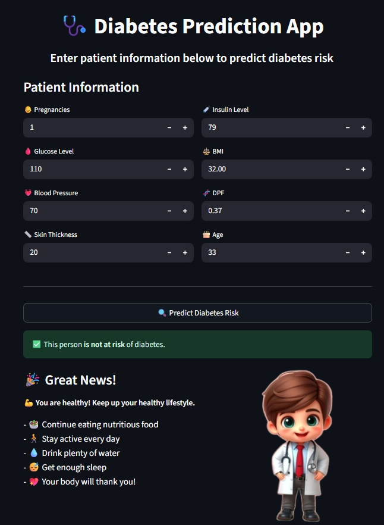
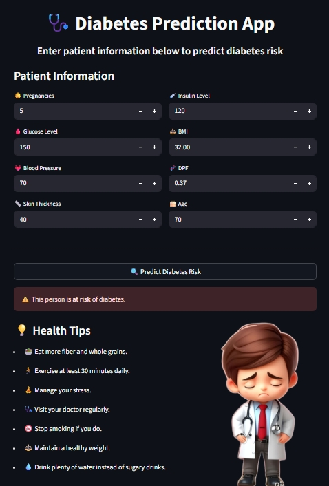

<p align="center">
  
</p>

# 🩺 Diabetes Prediction App (XGBoost-powered)

This web app predicts the likelihood of diabetes using patient information such as glucose level, BMI, age, and more. Built with **Streamlit**, trained on a cleaned and scaled dataset, and deployed with an **XGBoost** model for high accuracy.

---
## Overview

This web app allows users to input health data (glucose, BMI, age, etc.) and get predictions on diabetes risk. It gives personalized advice and visual feedback based on the result.

Built with:

- Python
- Streamlit
- scikit-learn
- XGBoost

---

## Data Preprocessing

- Handled missing and zero values carefully.
- Applied `StandardScaler` to normalize the data.
- Visualized feature distribution and checked for outliers.

---

## Feature Analysis

- Used correlation heatmap to study features.
- Found **Glucose**, **BMI**, and **Age** to have the strongest correlation with diabetes.
- Removed irrelevant features and kept the most impactful ones.

---

## 🤖 Model Development

### Tried multiple classifiers:

- Logistic Regression
- K-Nearest Neighbors
- Decision Tree
- Random Forest
- **XGBoost (Best performance)**

### Why XGBoost?

- More accurate for tabular medical data.
- Handles imbalanced and noisy data better.
- Allows fine control via hyperparameters.

---


## GridSearchCV & Hyperparameter Tuning

To improve model performance and compare classifiers effectively, I used `GridSearchCV` as a tool for hyperparameter tuning across different models. This allowed me to:

 - Systematically try different model types (SVM, KNN, Decision Tree, etc.)

 - Evaluate their performance using cross-validation

 - Find optimal hyperparameters such as `max_depth`, `learning_rate`, `n_estimators`, etc.

Example for XGBoost:
```
XGBClassifier(learning_rate=0.01, max_depth=4, n_estimators=500)
```
 - Reduced `max_depth` to avoid overfitting

 - Tuned `n_estimators` to balance accuracy and generalization

## Run Locally

 1. Clone the repo

 2. Install packages
 ```
pip install -r requirements.txt
```
 3. Run app
  ```
streamlit run app.py
```

## 🌐 Try on Google Colab

You can explore the model training and data preprocessing steps directly in Google Colab:

🔗 [**Open Colab Notebook**](https://colab.research.google.com/drive/1vK1Utzq9VVvzOk407Ox2fnaKqVnS8Zyg?usp=sharing)  

## Web App

Here’s a quick look at the app in action:

<p align="center">
  
  
</p>


## 📁 File Structure


```bash
├── app.py                   # Main Streamlit application
├── diabetes.py              # Model is Code
├── Diabetes.ipynb           # Jupyter Notebook for training and tuning the model
├── models/                  # Trained models and preprocessing tools
│   ├── model.json           # XGBoost model saved after training
│   └── scaler.pkl           # StandardScaler used to scale input features
├── images/                  # General project or UI screenshots
├── web_images/              # Images specifically used in the web app interface
├── requirements.txt         # Python dependencies
└── README.md                # Project documentation
```


## Contact & Credit

Made with by **Menna Atef**

This project was built as part of the **NTI Artificial Intelligence Scholarship** 🇪🇬

- Email: [mennaatef222006@gmail.com](mailto:mennaatef222006@gmail.com)  
- LinkedIn: [linkedin.com/in/menna-atef-05355b32a](https://www.linkedin.com/in/menna-atef-05355b32a/)  
- NTI Scholarship: [nti.sci.eg](https://nti.sci.eg/)

